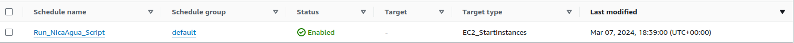

### NicaAgua Schedueler
This project runs downloads the necessary data to generate the long and short term forecasts. 

## Structure

- task.js
    - Main file for this application. It runs sequencially each part of the process.
    - Pulls the latest changes from the active branch.
    - At the end of the execution it halts the machine to avoid charges on AWS.
- downloadFTP.js
    - Download the necessary data for generating the forecasts.
    - Unzip the downloaded files and stores in the target Destination. 
    - The auxiliary file "folders.json" contains the source and destination for each file. 
- downloadIri.js
    - The download from this sorce is done through HTTP
-  runR.js
    - Calls the Pre-processing Script and the RScript created by the Environmental Engineering Team.

## AWS Structure
- The instance  NicaAgua_Medium has everything setup, to access it through SSH **you will need the .pem file**. This instance is located in Northern California Region. 
- A Event Schedueler called "Run_NicaAgua_Script" is configured to startup the instance exactly at 1:00 AM (UTC-5) every day. [Go to Scheduelers]("https://us-west-1.console.aws.amazon.com/scheduler/home?region=us-west-1)

- There is an AMI image of the this instance in case of a recovery is needed.

## Server 
- The server has PM2 installed and the script task.js configured to run when the server starts.
